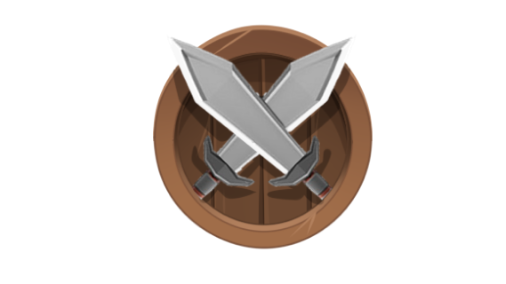
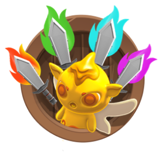
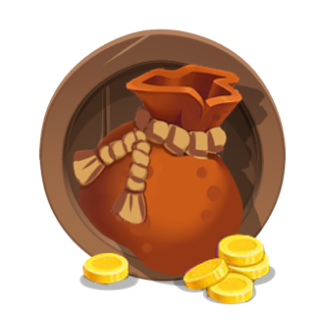

# Beast Born

<figure><figcaption></figcaption></figure>

[Beast Borne ](https://beastborne.com/)is a web3 turn base PvP game where the player collects and breeds creatures, levels them up, and competes against other players with a group of 3 creatures.

<figure><figcaption></figcaption></figure>

## Beast Borne World

<figure><figcaption></figcaption></figure>

### 1v1 PvP

Create a formidable squad of up to three creatures and engage in thrilling 1v1 turn-based battles against fellow players.

<figure><figcaption></figcaption></figure>

### Breed and customize creatures

Within the game, you can breed and acquire new creatures. Moreover, you'll be free to customize your creatures' abilities, enabling you to curate the perfect team of your dreams.

<figure><figcaption></figcaption></figure>

### Strategize and compete

Engage in ranked matches against formidable opponents to elevate your ranking, unlock various rewards, and vie for top positions on the leaderboards. Select your creatures wisely and devise winning strategies to claim the coveted title of the best.

<figure><figcaption></figcaption></figure>

### Play and Earn

As you engage in gameplay, you'll have the opportunity to earn tokens, transforming your enjoyment into a rewarding experience. The better you become in the game, the more tokens you'll accumulate, allowing you to reap greater financial benefits while having a great time.
