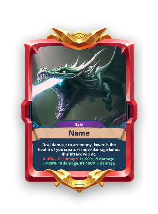

# Abilities & Consumables

Abilities

<figure><figcaption></figcaption></figure>

Each creature possesses a set of abilities that are crucial in combat. Abilities are categorized by targeting type—single-target, multi-target, and random target—and can perform various effects such as:

* **Stun**: Temporarily disables a creature.
* **Damage Over Time (DOT)**: Inflicts continuous damage.
* **Buff**: Temporarily enhances a creature’s stats.
* **Debuff**: Weakens an opponent’s stats.
* **Cure**: Removes negative effects.
* **Heal**: Restores a creature’s health.

Abilities have cooldowns, and buffs and debuffs can influence their effectiveness.

## Healing Potion 
