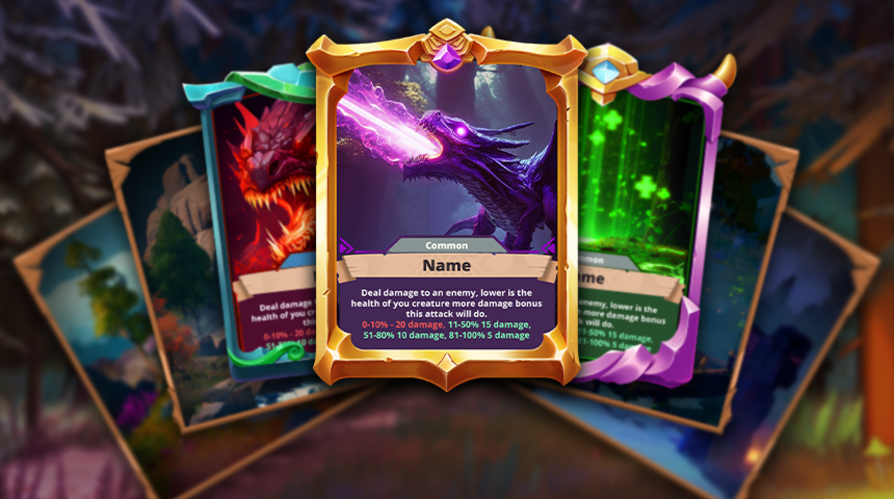
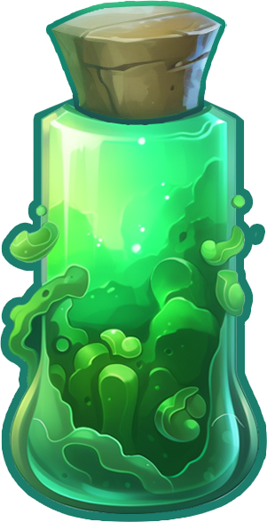
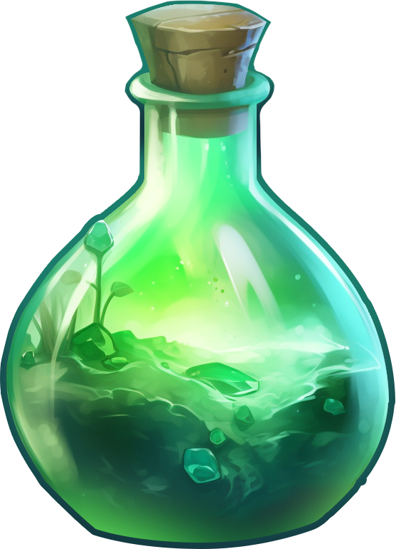

# Abilities & Consumables

## Abilities

<figure><figcaption></figcaption></figure>

Each creature possesses a set of 4 abilities that are crucial in combat. Abilities are categorized by targeting type—single-target, multi-target, and random target—and can perform various effects such as:

* [**Attack:** default ability based on creature type.](#user-content-fn-1)[^1]
* **Stun**: Temporarily disables a creature.
* **Damage Over Time (DOT)**: Inflicts continuous damage.
* **Buff**: Temporarily enhances a creature’s stats.
* **Debuff**: Weakens an opponent’s stats.
* **Cure**: Removes negative effects.
* **Heal**: Restores a creature’s health.

Abilities have cooldowns, and buffs and debuffs can influence their effectiveness.

## **Initial Ability Cards**

When a creature is first acquired, it receives **three random ability cards** drawn from a pool of abilities specific to its rarity. These abilities define the creature’s combat skills, such as attack types, defensive maneuvers, or support actions.

* **Rarity-Based Abilities**: The pool of available abilities is determined by the creature’s Common, Rare, or Legendary. Higher rarity creatures have access to more powerful and unique skills, making them highly desirable in battles.
* **Random Assignment**: The abilities are assigned randomly, adding an element of chance and uniqueness to each creature, even among those of the same type and rarity.

## **Reshuffling Abilities**

Players can **reshuffle** ability cards they do not want, allowing them to replace unwanted abilities with new ones that may better suit their strategy. Reshuffling is a crucial aspect of the game, offering players a way to fine-tune their creatures and maximize their effectiveness in combat.

## **Types of Reshuffling**

**Regular Reshuffling**:

* **Cost**: 5,000 Crystals or 5 Coins (BST).
* **Mechanism**: This option replaces the selected ability card with another random ability from the creature’s available pool. The result is entirely random, allowing players to improve their creature’s abilities without a high cost.

**Premium Reshuffling**:

* **Cost**: 20 Coins (BST).
* **Mechanism**: This premium option provides the player with three random ability cards from the creature’s available pool. Players can then choose one of the three cards to replace the current ability, allowing for a more strategic selection process.
* **Bad Luck Protection**: The premium reshuffle includes bad luck protection to ensure a fair reshuffling experience. The reshuffled card and the three cards shown to the player will not appear in the next two premium reshuffles, preventing repeated unwanted results and enhancing the chances of obtaining a desirable ability.

### Targeting type

Each ability will have its targeting type. There will be the following targeting types:

* **Single target:** This type of ability affects a selected single creature. Also, the single target abilities may be friendly, self-use, or enemy.&#x20;
* **Multi-targeting:** this ability targeting type affects all friendly or opponent creatures, sometimes even both.&#x20;
* **Random targeting:** this type of ability affects random targets. This type of ability will specify which targets it may affect: random ally creatures or random opponent creatures, or it can randomly affect any target.

### Default abilities

Based on the type of the creature, each of them has its default melee attacks. This card is always on them and can not be changed.

* Sharkman - Sharkman punch
* Zunnies -  Zunny melee
* Moon bits - Moon bits melee
* Oregon - Oregon Head bump

## Healing Potion 

After the battles, the creatures will not recover their health and the easy way to heal them is by using healing items. There will be 3 types of healing potions:

<figure><figcaption></figcaption></figure>

Small potion - recovers 20 health points - costs 25 crystals

<figure><figcaption></figcaption></figure>

Medium potion - recovers 60 health points - costs 50 crystals

<figure><figcaption></figcaption></figure>

Large potion - fully recovers creatures' health - costs 15 coins

\
Health potions can be acquired from the Item store or players can get them as rewards for completing PVE or PVP matches&#x20;

### Drop chances

<table><thead><tr><th width="291">Drop condition</th><th width="156">Type</th><th>Drop Chance</th></tr></thead><tbody><tr><td>Winning Ranked PVP</td><td>Small</td><td>18%</td></tr><tr><td></td><td>Medium</td><td>14%</td></tr><tr><td></td><td>Large</td><td>8%</td></tr><tr><td>Losing Ranked PVP</td><td>Small</td><td>6%</td></tr><tr><td></td><td>Medium</td><td>14%</td></tr><tr><td></td><td>Large</td><td>11%</td></tr><tr><td>Winning Regular PVP</td><td>Small</td><td>15%</td></tr><tr><td></td><td>Medium</td><td>11%</td></tr><tr><td></td><td>Large</td><td>5%</td></tr><tr><td>Losing Regular PVP</td><td>Small</td><td>6%</td></tr><tr><td></td><td>Medium</td><td>8%</td></tr><tr><td></td><td>Large</td><td>6%</td></tr><tr><td>Completing PVE mission for the first time</td><td>Small</td><td>40%</td></tr><tr><td></td><td>Medium</td><td>40%</td></tr><tr><td></td><td>Large</td><td>20%</td></tr></tbody></table>

[^1]: 
