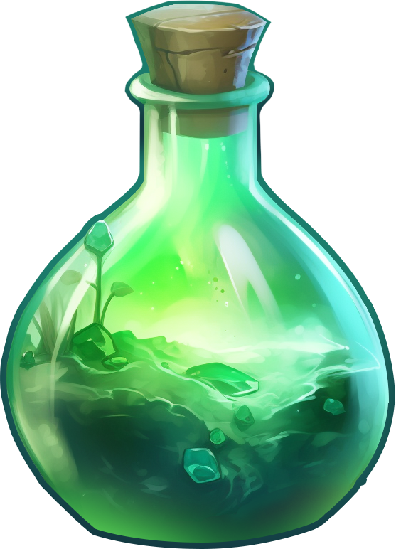

# Combat

## Combat

Combat is a central element of **Beast Borne**, offering players thrilling and strategic battles in both PvP and PvE modes. The combat system combines tactical decision-making with dynamic creature abilities, ensuring each battle is unique and engaging.

### **Starting a Match**

When a match begins in PvP or PvE mode, the game loads the battle environment, and combat is initiated. Before any moves are made, a coin flip determines which player goes first. The coin has "1" on one side and "2" on the other, and once the outcome is decided, the battle starts.

### **Combat Interface**

During combat, the game’s user interface helps players make strategic decisions by clearly displaying each creature's status and available actions.

### **During the Player’s Turn:**

* **Creature Icons**: Displayed on the left side of the screen, showing each of the player’s three creatures in various states (Regular, Selected, Inactive, Inactive Selected, and Inactive Dead with a red skull icon).
* **Health Indicators**: Health bars and point numbers above each creature model show the current status of each creature.
* **Turn and Action Indicators**: The top of the screen displays the turn number and “Your Turn” text, while ability cards appear at the bottom, each showing whether they are active, inactive, or on cooldown.
* **Menu and End Turn**: Accessible at the upper right and lower right of the screen, allowing players to pause the game or end their turn.

### **During the Opponent’s Turn:**

* **Creature Icons**: The player’s creatures appear in a disabled state, with ability cards grayed out to indicate they cannot be used.
* **Turn Information**: “Opponent’s Turn” text and the current turn number appear at the top.
* **Opponent Actions**: When the opponent plays a card, the used ability is displayed, allowing players to see the effects of each action.

### **Damage, Healing, and Status Effects**

When creatures are damaged or healed, the corresponding amount is visually displayed with numbers and icons—red for damage and green for healing. Additionally, various status effect icons are shown beneath creatures' health bars, including:

* **Stun**: Disables a creature for a set number of turns.
* **Poisoned (Purple)**: Inflicts damage over time (DOT).
* **Burning (Red)**: Causes continuous damage.
* **Shield (Blue)**: Provides temporary protection.
* **Weaken (Purple)**: Reduces a creature's effectiveness.
* **Damage Buff (Blue)**: Enhances a creature’s attack.
* **Armor Buff (Blue)**: Increases defense.
* **Confusion Debuff**: Causes creatures to potentially misfire their attacks.
* **Taunted (Red)** and **Taunt (Yellow Shield)**: Forces targeted behavior in combat.

Each icon displays a number indicating that the effect will last for the remaining turns.

### **Selecting Creatures and Using Abilities**

* **Creature Selection**: At the start of the player’s turn, the first creature is automatically selected, highlighted along with its ability cards. Players can switch to other creatures by clicking on their icons, but once a creature has used its ability, it becomes inactive.
* **Using Abilities**: Players interact with ability cards by touching and dragging them toward the desired target. Depending on the ability type (single target, multi-target, or random), the relevant creatures are highlighted to guide the player.

### **Buff, Debuff, and Cooldown Durations**

* **Buffs, Debuffs, and DOT**: The duration of these effects is counted by the turns of the player who owns the affected creature. For example, if a player’s creature has a buff, the duration decreases at the end of the player's turn.
* **Cooldowns**: Cooldowns for abilities are managed similarly, ensuring strategic timing of powerful moves.

### **Turn Timer**

* **Time Limit**: In PvP mode, each player has 30 seconds to complete their turn. A 10-second countdown appears after 20 seconds have passed, accompanied by sound effects. If no action is taken, the next turn begins with reduced time, allowing only 7 seconds until an action is performed.
* **Inactivity**: If both players are inactive for three consecutive turns, the match ends, and a pop-up will indicate disconnection due to inactivity.

## Health Recovery

In **Beast Borne**, your creatures' health is a critical factor in their effectiveness during battles. After a battle, any damage sustained by your creatures does not automatically heal to full, requiring players to actively manage their recovery before the next encounter. Players have two primary options to restore a creature’s health: **Passive Recovery** and **Health Potions**.

### **Passive Recovery**

Creatures gradually regain health over time at a rate of 1 HP per minute. This slow recovery allows players to continue using their creatures after rest, but it may not be sufficient if a creature has sustained significant damage.

### **Health Potions**

For immediate recovery, players can use Health Potions. These items provide instant healing, allowing creatures to regain their strength and return to battle quickly. There are three types of Health Potions available, each offering different levels of healing to suit the needs of your creatures.

<figure><figcaption></figcaption></figure>

Small potion - recovers 20 health points - costs 25 crystals

<figure><figcaption></figcaption></figure>

Medium potion - recovers 60 health points - costs 50 crystals

<figure><figcaption></figcaption></figure>

Large potion - fully recovers creatures' health - costs 3 coins

\
Health potions can be acquired from the Item store or players can get them as rewards for completing PVE or PVP matches&#x20;

### Drop chances

<table><thead><tr><th width="291">Drop condition</th><th width="156">Type</th><th>Drop Chance</th></tr></thead><tbody><tr><td>Winning Ranked PVP</td><td>Small</td><td>18%</td></tr><tr><td></td><td>Medium</td><td>14%</td></tr><tr><td></td><td>Large</td><td>8%</td></tr><tr><td>Losing Ranked PVP</td><td>Small</td><td>6%</td></tr><tr><td></td><td>Medium</td><td>14%</td></tr><tr><td></td><td>Large</td><td>11%</td></tr><tr><td>Winning Regular PVP</td><td>Small</td><td>15%</td></tr><tr><td></td><td>Medium</td><td>11%</td></tr><tr><td></td><td>Large</td><td>5%</td></tr><tr><td>Losing Regular PVP</td><td>Small</td><td>6%</td></tr><tr><td></td><td>Medium</td><td>8%</td></tr><tr><td></td><td>Large</td><td>6%</td></tr><tr><td>Completing PVE mission for the first time</td><td>Small</td><td>40%</td></tr><tr><td></td><td>Medium</td><td>40%</td></tr><tr><td></td><td>Large</td><td>20%</td></tr></tbody></table>
