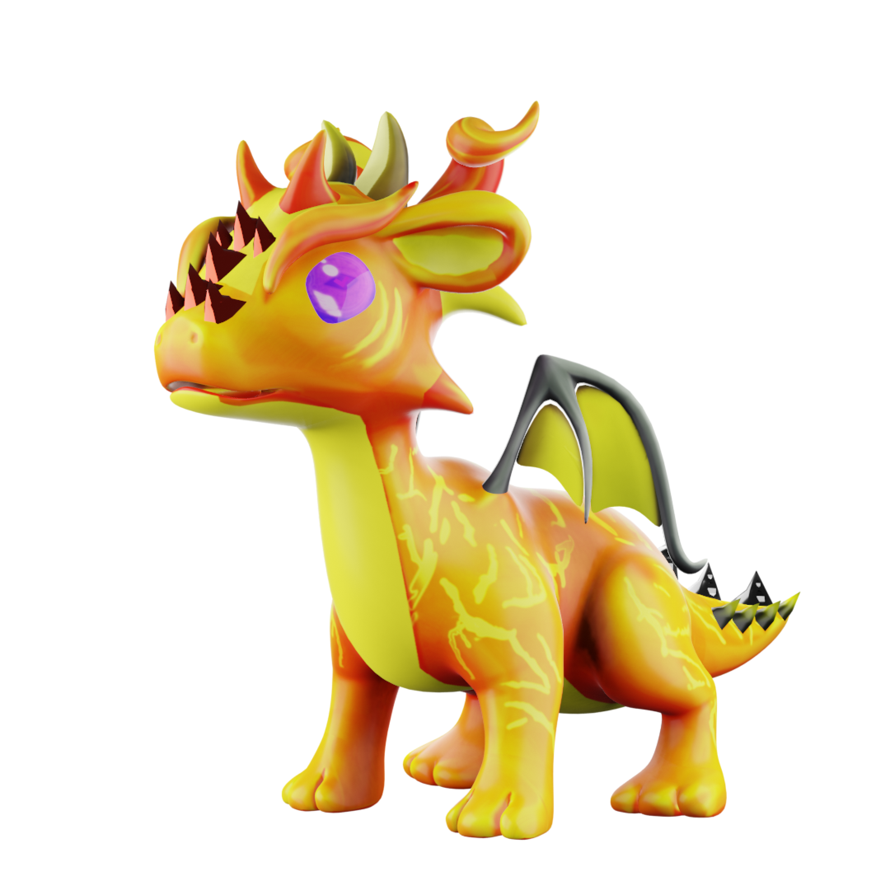
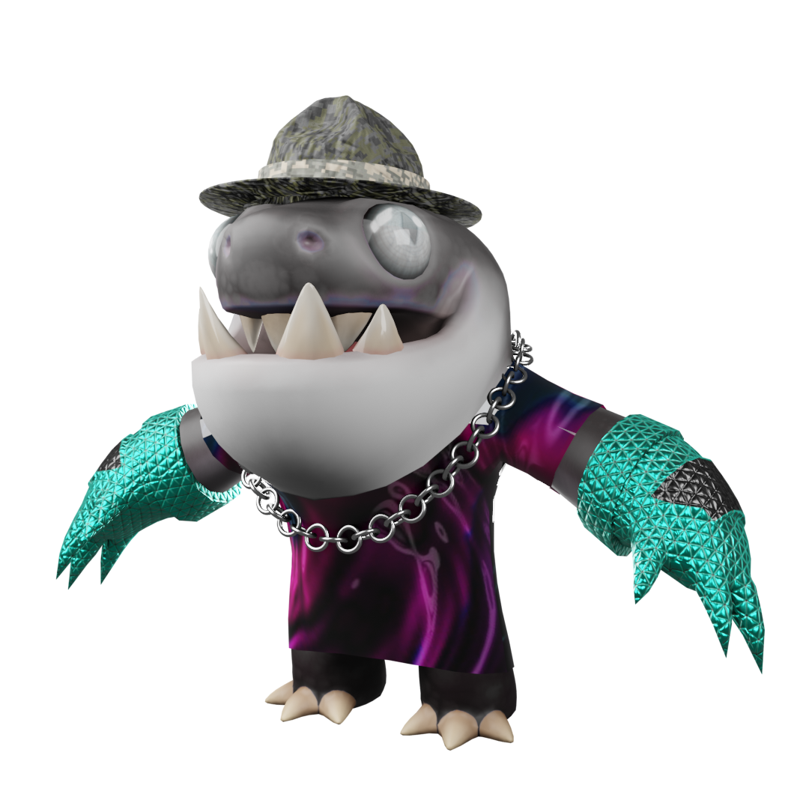
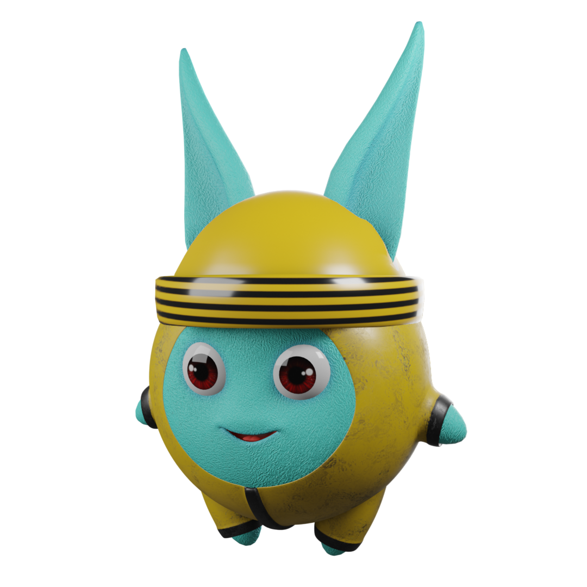
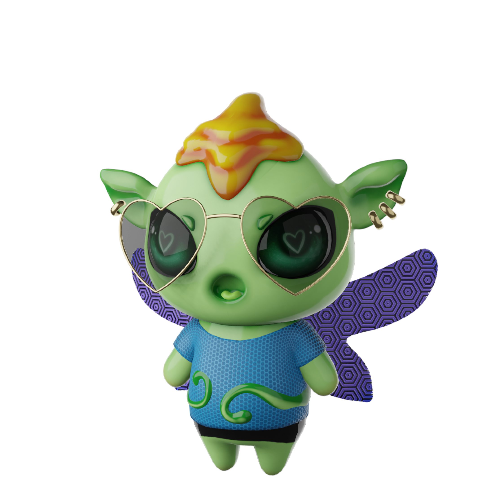

# Creatures

## Creatures

Creatures come in three rarities: <mark style="color:yellow;">Common</mark>, <mark style="color:blue;">Rare</mark>, and <mark style="color:purple;">Legendary</mark>. Rarer creatures have stronger abilities and higher health.

### Oregon

<figure><figcaption></figcaption></figure>

Oregons are adorable little dragons inhabiting the enchanting realm of Elysium. Their deceptively cute appearance conceals their true nature as formidable hunters who unfailingly secure their prey.

With their exceptional attacking and fire-breathing capabilities, Oregons excel as primary combatants, earning their reputation as creatures of the fighter archetype.

### Sharkman

<figure><figcaption></figcaption></figure>

In the lakes of Elysium dwell the fearsome Sharkmen, relentless hunters that strike terror into the hearts of those who venture near.

Their rugged skin renders them impervious to pain and challenging battles against them.

Revered as tank archetypes, Sharkmen can draw opponents' attention, effectively safeguarding friendly creatures within their presence. Thus, caution should prevail when traversing their territory.

### Zunnie

<figure><figcaption></figcaption></figure>

Zunnies, seemingly adorable creatures at a glance, harbor an inner chaos that manifests through their ability to release toxic gases.

Moreover, they possess magical powers, adding an element of mystique to their nature. With their unpredictable attacks, Zunnies can inadvertently harm nearby creatures, embodying their chaotic disposition. Functioning as a hybrid archetype, they combine aspects of both support and damage roles.

Zunnies wield the power to heal, poison, or unleash chaotic damage upon those in their vicinity, leaving a trail of unpredictability in their wake.

### Moonbit

<figure><figcaption></figcaption></figure>

Residing within the mystical realm of Elysium, Moonbits are enchanting fairies that radiate pure luminescence.

With unwavering joy, they eagerly employ their magical prowess to mend and befriend other creatures.

Embodying the support archetype, Moonbits serve as invaluable allies, safeguarding friendly creatures from harm, mending their wounds, and providing potent curative abilities.

Having a Moonbit within your team proves immensely advantageous, as their presence brings a versatile and nurturing essence to any encounter.
