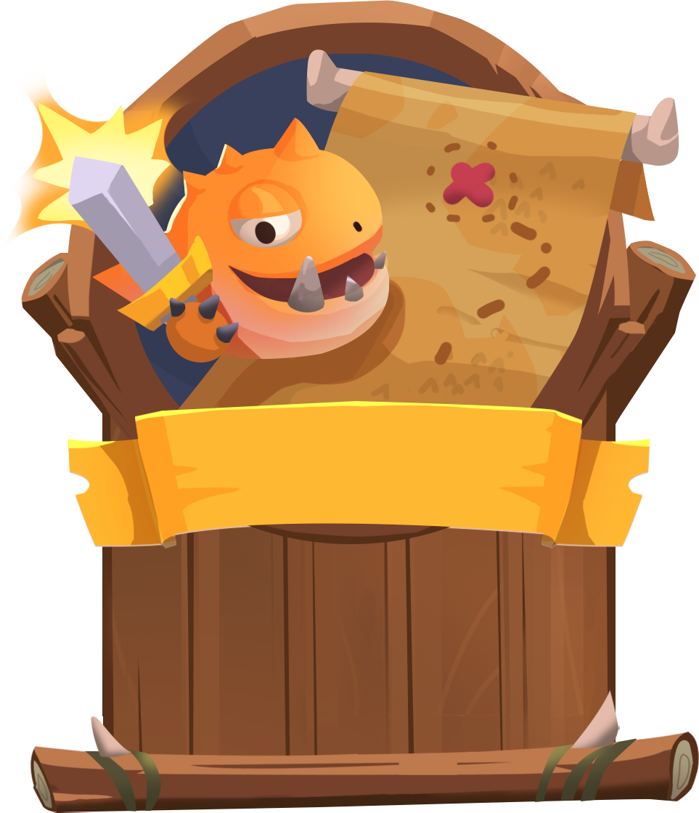

# PvE

<figure><figcaption></figcaption></figure>

## Story Company

In the PVE mode, there will be six chapters, each with six missions. (Overall, 36 missions). Each chapter will introduce players to one of the environments, and players will need to play six missions (one after another) to complete that chapter and unlock the next one.

### Chapters will have the following environments:

* Chapter 1 - Valley
* Chapter 2 - Lake
* Chapter 3 - Forest Ruin
* Chapter 4 - Desert
* Chapter 5 - Waterfall
* Chapter 6 - Stonehenge

#### Chapter completion rewards

When completing the last level of the chapter and completing the chapter player will earn chapter completion rewards. Chapters will also have stars and the rewards will depend on how many stars players have got when completing missions in that chapter.

* 3 Stars - if all levels of that chapter were completed with three stars - 2 coins
* 2 Stars - if all levels of that chapter were completed with two stars or above - 2 coins
* 1 Star - if all levels of that chapter were completed with one star or above - 1 coin

If the player completes the chapter with 1 star, the player gets according to rewards. Still, after that, if the player plays the missions of that chapter again and gets 3 stars on all the missions of that chapter, the chapter will get 3 stars and the player will get the remaining rewards of that chapter (4 coins).

### Missions

Each mission will be a match against the AI opponents with different difficulties. The more player progresses through missions higher the difficulty gets.&#x20;

Each mission will have 3 completion stars. The stars will indicate how well the player completed the level. If during the match the player loses a creature, the player gets one star less when completing the level. So if the player completed the level with 3 creatures alive player gets 3 stars, 2 creature alive gets 2 stars, and if 1 creature is alive gets 1 star. The player can always replay the mission after completing it in order to get 3 stars.

Also, some missions may only have 1 or 2 opponent creatures. So for every mission, we should be able to select amount of creatures there should be in the level and difficulties for each creature.

#### Mission completion rewards

When completing the mission for the first time player will get account XP and soft currency as a reward. The amount of the XP and soft currency will depend on the number of stars they get during the mission.

3 stars - 150 crystals and 100xp

2 stars - 100 crystals and 60xp

1 star - 50 crystals and 30xp

If the player completes the mission with 1 star, the player gets according to rewards, but after that, if the player tries again and gets 3 stars on the same mission, the player will get the remaining rewards of that mission (250 crystals and 160xp).&#x20;

Also, completing the mission for the first time, the player will also earn a health potion. You can see the health potion drop chances via this [link](https://docs.google.com/spreadsheets/d/19aigeJu5Te6EpjQJS7QM7fqEP6cnmh6P-ZtIOSM9us4/edit?usp=sharing).

## Daily missions

Every day players will get a new daily mission, where they will need to fight 3 random creatures in a random environment. Daily missions refresh every 24 hours and can be completed once each day. After failing the mission players still will be able to try win it in order to get rewards before it refreshes.&#x20;

The rewards for completing a daily mission are 300 crystals, 1 coin and 100xp.\
