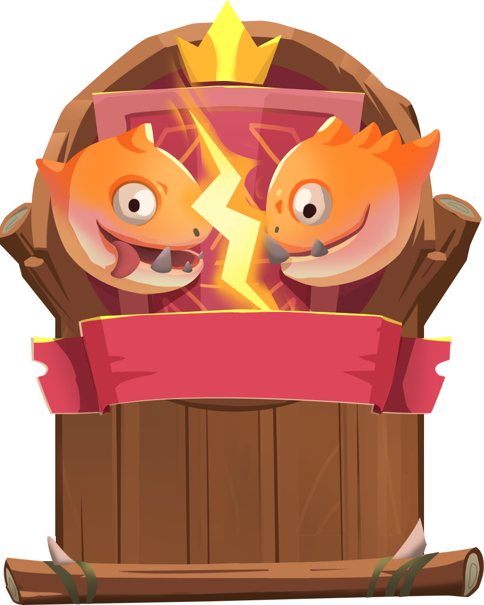

# PvP

<figure><figcaption></figcaption></figure>

## PvP Mode

**Beast Borne** offers an engaging and competitive **Player vs. Player (PvP)** mode where players can test their skills against others in dynamic battles. The PvP mode is designed to provide a balanced and strategic combat experience, with rewards that scale based on player performance and rank.

### **Overview**

In PvP mode, players are matched against each other in a randomly chosen battle environment. Each match begins with a coin flip to determine which player goes first. A turn timer is implemented to maintain a smooth and fast-paced experience, ensuring that no player is left waiting for extended periods.

PvP mode features two sub-modes: **Regular** and **Ranked**, each catering to different player goals, from casual play to competitive ranking.

### **Regular Mode**

**Regular Mode** is the entry-level PvP experience, allowing players to experiment with different combinations of creatures and abilities without the pressure of high stakes. This mode is accessible without any entry fee, allowing players to focus on improving their skills and strategies.

* **Matchmaking**: Players are matched based on their account level, ensuring fair battles against opponents of similar experience and skill.
* **Rewards**:
  * **Winning:** Players earn 30 XP and 300 Crystals and have a chance to receive a health potion.
  * **Losing**: Players earn 10 XP and have a chance to receive a health potion.

Regular Mode is a practice ground, helping players refine their tactics before diving into the more competitive Ranked Mode.

### **Ranked Mode**

**Ranked Mode** is where players compete to climb the leaderboard and earn ranks, with rewards that reflect their achievements. This mode offers a structured progression system where players accumulate rank points by winning matches, unlocking new ranks, and facing increasingly challenging opponents.

* **Rank Points and Ranks**:
  * Players earn 100 rank points for winning a match.
  * Ranks are awarded upon reaching specific point milestones:
    * **Stone**: 0 points
    * **Wooden**: 500 points
    * **Bronze**: 1,500 points
    * **Silver**: 3,500 points
    * **Gold**: 6,500 points
    * **Platinum**: 10,000 points
    * **Diamond**: 15,000 points
  * Starting from the Silver rank, players can lose rank points if they are defeated. The number of points lost depends on their current rank, with higher ranks resulting in more significant penalties.
* **Dynamic Point Adjustments**:
  * Players receive additional rank points (+25) for defeating opponents of a higher rank.
  * Players earn fewer points (75 instead of 100) when defeating lower-ranked opponents.
  * Similarly, losing to a higher-ranked opponent reduces point loss, while losing to a lower-ranked opponent increases the penalty.
* **Entry Fee and Rewards**:
  * Ranked matches require an entry fee of 5 Coins (BST) per player, with the winner receiving 80% of the opponent's entry fee.
  * **Rewards for Winning**: 9 Coins, 100 XP, and a 40% chance to receive a medium health potion.
  * **Rewards for Losing**: 30 XP and a 10% chance to receive a medium health potion.
* **Rank Rewards**:
  * Each new rank achieved awards players with Coins, Crystals, and XP as follows:
    * **Wooden**: 2 Coins, 1,000 Crystals, 500 XP
    * **Bronze**: 4 Coins, 2,000 Crystals, 1,000 XP
    * **Silver**: 6 Coins, 3,000 Crystals, 1,500 XP
    * **Gold**: 10 Coins, 5,000 Crystals, 2,000 XP
    * **Platinum**: 15 Coins, 8,000 Crystals, 2,500 XP
    * **Diamond**: 20 Coins, 10,000 Crystals, 3,000 XP

Players can earn these rewards only once they reach a new rank. The rewards are not reissued if they drop in rank and climb back.

### **Leaderboards and Rank Resets**

Ranked Mode features a leaderboard that tracks player rankings based on their total rank points. Seasons last between 3 and 6 months, after which ranks are reset. At the beginning of a new season, players start two ranks below their previous position, creating fresh opportunities to compete for the top spots.

**Seasonal Rewards** are distributed to players who finish in top positions. They offer additional Coins (BST) and other valuable items, motivating players to maintain or improve their ranks each season.

### **PvP Matchmaking**

* **Regular Mode**: Matchmaking is based on account level, aiming to find opponents of similar experience.
* **Ranked Mode**: Matchmaking is based on rank points, prioritizing players at the same rank or within one rank range.

### **Match Completion Pop-ups**

After each PvP match, a result screen shows the outcome:

* **Victory Pop-up**: Displays the rewards earned, including XP, Crystals, and Coins (BST).
* **Defeat Pop-up**: Shows the XP earned and any potential potion drops.
